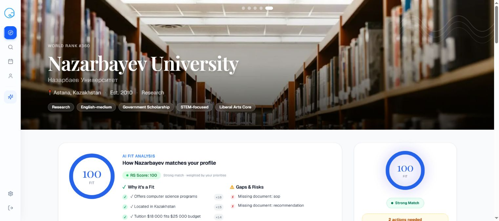
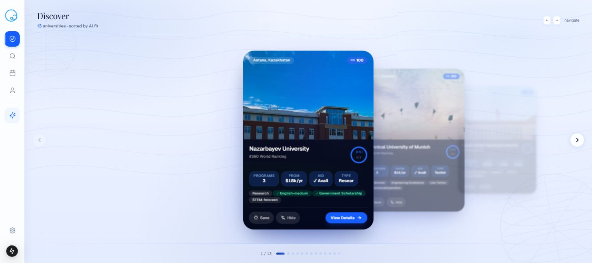
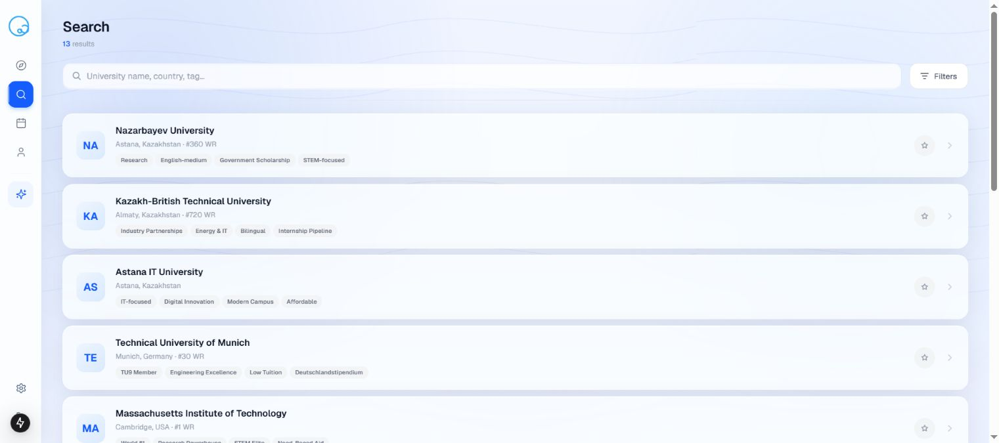
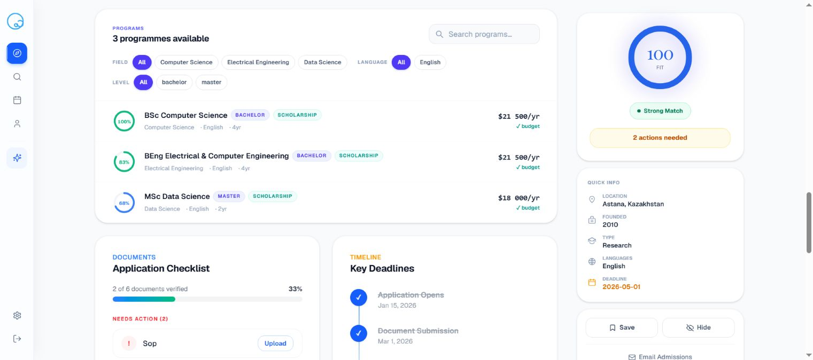
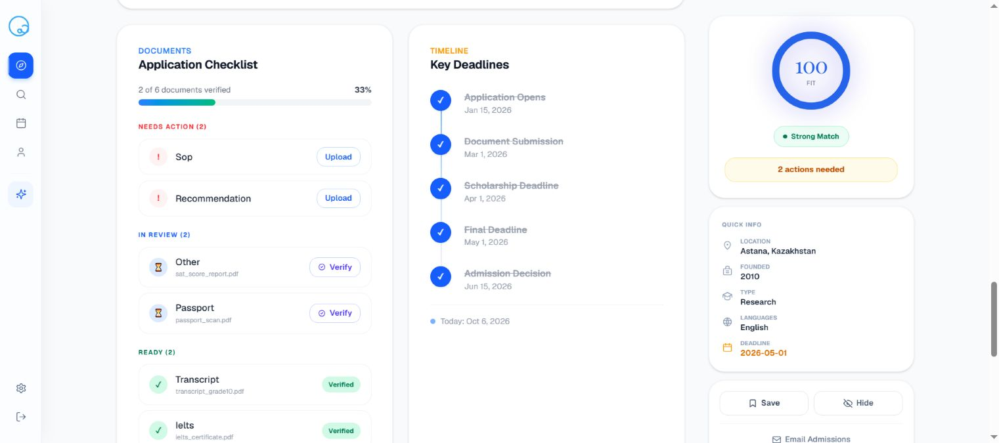
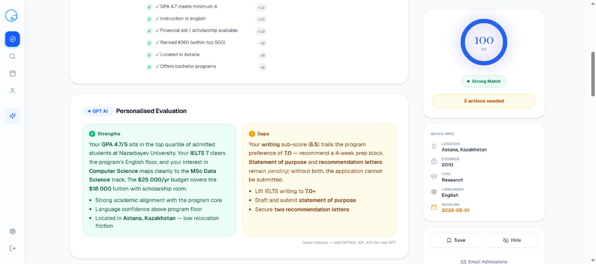

# QApp
### Turn “this university looks interesting” into a preparation plan.

A study-abroad planning prototype that connects a student profile, university discovery, fit explanations, documents and deadlines. The aim is to keep exploration and the next required action in the same product.

*A university detail page in the restored application. Profile, prices, campus imagery and fit values belong to the seeded demo, not verified admissions guidance.*

## Seven questions a university page should answer

An applicant needs more than a long list of institutions. QApp’s detailed profile is organized around practical questions: does the university fit, which programs match, which documents are ready, what is missing, what should happen next, when is it due, and why does this option belong on the shortlist?

The student profile supplies academic results, language scores, budget, interests and study-level preferences. Those inputs make comparisons personal. A university can be academically attractive but financially unsuitable, or offer the right program while still requiring an incomplete document package.

## Browse, search, then narrow the shortlist

The discovery screen presents one university at a time with campus context, program information, cost and a fit summary. Saving and hiding give the student a way to shape the shortlist. The search screen provides a denser catalogue view for returning to a known option or comparing several possibilities.

*Discovery with a fictional student profile and a 13-university demonstration catalogue.*

*The catalogue view makes location and university characteristics easy to scan. Rankings and prices are seeded prototype records, not current guidance.*

### What happens after opening a university

The detailed page combines a campus hero with program filters, scholarships, requirements, a fit breakdown and a sticky overview. Programs can be explored by field, language, degree and fit. The explanation connects the student’s inputs to strengths and gaps instead of presenting an isolated score.

*Program-level comparisons with field, language and degree filters. Tuition and scores are seeded records.*

Document readiness is tracked separately: **ready**, **pending review** and **missing** do not mean the same thing. A student who has selected a university still needs an actionable checklist, and an uploaded file is not automatically a verified application document.

*The same detail page connects document readiness and deadlines. Document names and verification states are demo fixtures; no applicant files were uploaded for this capture.*

## From profile to action

~~~mermaid
flowchart LR
 A[Academic profile and priorities] --> B[University fit calculation]
 C[University and program records] --> B
 B --> D[Reasons, strengths and gaps]
 E[Document readiness] --> F[Preparation actions]
 D --> F
 F --> G[Deadline timeline and shortlist]
~~~

The fit score is a **planning indicator on a 0–100 scale**, not a probability of acceptance. Changing priorities should change the comparison in an understandable way. Language-model assistance adds explanation and conversation, while the underlying catalogue and profile provide the structured context.

*Strengths, gaps and suggested actions in the explicitly labelled Demo fallback state. This is interface evidence, not a validated recommendation or a live GPT result.*

| Product area | Concrete behaviour |
|---|---|
| Profile | Academic results, budget, interests and weighted preferences |
| Discovery | University carousel, search, save and hide |
| University detail | Programs, scholarships, requirements and fit reasons |
| Preparation | Document status, missing items and recommended next actions |
| Planning | Deadlines and a timeline connected to the shortlist |

## Built as a complete application prototype

The implementation uses **Next.js 15, TypeScript, Prisma, SQLite and NextAuth**, with an AI SDK integration for model-assisted features. Profile, preference, document and university operations have dedicated application routes. The frontend uses a consistent navigation rail so discovery, search, timeline and personal preparation remain adjacent.

The local demonstration used for this case study was restored from the repository schema and seed data. The catalogue contains 13 universities and the visible student is fictional. The screenshots demonstrate the application’s presentation; they do not verify admissions policies, document acceptance or recommendation accuracy.

The project’s value is the connection between finding an option and doing the work required to pursue it. A university page becomes a working plan rather than another bookmark to revisit later.

---

### Built by

[Shakhnazar Akhmer](https://github.com/Eye172) and the **Impact Admissions × QApp hackathon team**.

[More projects](https://github.com/Eye172) · [Contact](mailto:shakh090909@gmail.com)

This repository presents the product and its engineering. Implementation and internal data are maintained separately. Screenshots and documented experiments are identified in their captions.
