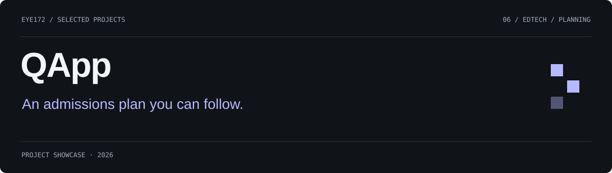
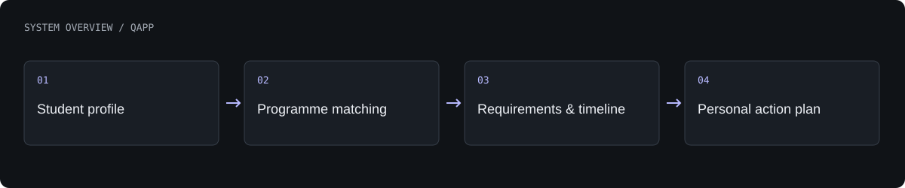

# QApp

A personalized university-admissions workspace connecting student profiles, programme discovery, requirements and next steps.

**Impact Admissions × QApp · hackathon MVP**

[What is built](#what-is-built) · [Architecture](#architecture) · [Authors](#authors) · [Profile](https://github.com/Eye172)

## What is built

- Build and edit a student profile with academic and personal preferences.
- Compare university programmes and inspect fit explanations.
- Track document requirements, scholarships, saved progress and deadlines.
- Use a contextual AI advisor and generated action plan.

## Architecture

A Next.js application serves the interface and API routes. Persistence stores profiles, university records, documents and progress. Deterministic matching is combined with model-generated explanations; a mock mode supports demonstration without a model key.

**Technology:** Next.js · TypeScript · Tailwind CSS · Prisma · SQLite · NextAuth · Vercel AI SDK.

## Current scope

The hackathon version uses seeded university data. Fit scores are planning guidance, not admissions decisions or guaranteed acceptance probabilities.

## Authors

[Shakhnazar Akhmer](https://github.com/Eye172) and the **Impact Admissions × QApp hackathon team**.

## About this repository

This is a standalone project showcase containing a product description, visuals and a high-level architecture overview. Implementation source, model weights, credentials and internal project materials are not distributed here. No deployment is required to explore this page.

[Contact](mailto:shakh090909@gmail.com) · [GitHub profile](https://github.com/Eye172)
